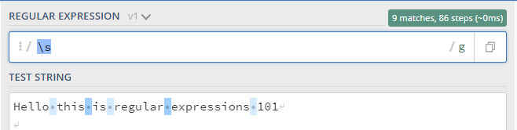

# Regex (Regular Expression) Tutorial

Welcome to the Regex Tutorial. Here, you will learn all about Regular Expressions, their various components and how it is used. So let's dive right in!

## Summary

What is Regex? Regex, or Regular Expression, is used to look for specific patterns in a large document such as an email address, username, URL etc. It can also be used as a verification tool. For example, if a website requires a user to enter their email address, Regex is used in order to verify that the user is only typing in an email address by looking at the pattern. So for this tutorial, we will use email.

## Table of Contents

- [Anchors](#anchors)
- [Quantifiers](#quantifiers)
- [OR Operator](#or-operator)
- [Character Classes](#character-classes)
- [Flags](#flags)
- [Grouping and Capturing](#grouping-and-capturing)
- [Bracket Expressions](#bracket-expressions)
- [Greedy and Lazy Match](#greedy-and-lazy-match)
- [Boundaries](#boundaries)
- [Back-references](#back-references)
- [Look-ahead and Look-behind](#look-ahead-and-look-behind)

---

## Regex Components

### Anchors

_^ and $ are Anchor tags_. _^ Tag is used at the beginning of a string where as the $ is used at the end of the string_

_For example:_

[^Hello](https://regex101.com/r/0xDsVz/1)

```
^Hello - this will match any string that starts with the word "hello".

```

[thanks$](https://regex101.com/r/zdQ1py/1)

```
thanks$ - this will match any string that ends with the word "thanks".
```

The two anchors can be used together as follows: `^Hello thanks$`

---

### Quantifiers

_Quantifiers include the following symbols: \* + ? and {}_. _See below for examples of how each symbol is used with the word hotmail:_

[hotmail\*](https://regex101.com/r/4pIB3n/1)

```
hotmail* - This quantifier will match a string that has 0 or more of the letter l in hotmail. Therefore, the even if it was spelt hotmai (without the l) it would still register as a match
```

[hotmail+](https://regex101.com/r/r41V1q/1)

```
hotmail+ - This quantifier will match a string that has 1 or more of the letter l. Therefore, the whole word "hotmail" and any additional letter l ("hotmaillllll" as an example) would still register as a match
```

[hotmail?](https://regex101.com/r/rkdQsd/1)

```
hotmail? - This quantifier will match a string that has either 0 or 1+ of the letter l
```

[hotmail{2}](https://regex101.com/r/mzXMQ7/1),
[hotmail{2,}](https://regex101.com/r/fQG93h/1),
[hotmail{2,7}](https://regex101.com/r/08SyYU/1)

```
hotmail{2} - This quantifier will match a string that has 2 of the letter l in this example
hotmail{2, } - This quantifier will match a string that has 2 or more of the letter l in this example
hotmail{2, 7} - This quantifier will match a string that has 2  and up to 7 of the letter l in this example
```

```
(hot)mail*+?{} - In this example "hot" in hotmail is in brackets. This is called the first capturing group. It will first identify that "hot" is in brackets and will highlight it seperately, then match the whole word based on the quanitifer used.
```

---

### OR Operator

_The OR operator includes the following symbols: | or []_

[(hotmail|gmail)](https://regex101.com/r/zPFbhV/1)

```
(hotmail|gmail) - Using the OR operator |, any email address with hotmail or gmail, will be highlighted. Hotmail is considered the 1st Alternative and gmail is the 2nd Alternative. test@hotmail.com or test@gmail.com. Both of these would be highlighted in different colours for distinction.
```

[hotma[il]](https://regex101.com/r/NeAMrC/1)

```
hotma[il] - Using the OR operator [], the letters "il" will be grouped as one match rather than separate matches.
```

---

### Character Classes

\_Character Classes involve looking for a specific digit, word character or whitespace between words. The following are character classes: \d \w \s and .

[\d](https://regex101.com/r/VJilsf/1)

```
\d - Matches and digit between 0-9. For example, if you are given an email address: test123@hotmail.com, using \d will match and highlight the numbers 123.
```

[\w](https://regex101.com/r/W1yPWs/1)

```
\w - Matches any word character from a-z, A-Z, 0-9, and the underscore symbol. For example: test123@hotmail.com would match completely.
```

[\s](https://regex101.com/r/XOi0Hl/1)

```
\s - Matches any whitespace character. Take the following example: Welcome to Regex 101.
The space between each word would match and be highlighted.
```



[period](https://regex101.com/r/wO6SgI/1)

```
. - The period matches any character (with the exception of line terminators). For example: test123_4@hotmail.com would match completely.
```

_NOTE: \d \w \s can also be capitalized \D \W \S and they will perform the opposite function that they would if presented as lower case._

### Flags

---

### Grouping and Capturing

---

### Bracket Expressions

---

### Greedy and Lazy Match

---

### Boundaries

---

### Back-references

---

### Look-ahead and Look-behind

---

## Author

Rani Saad
[Github Profile](https://github.com/rsaad86)
